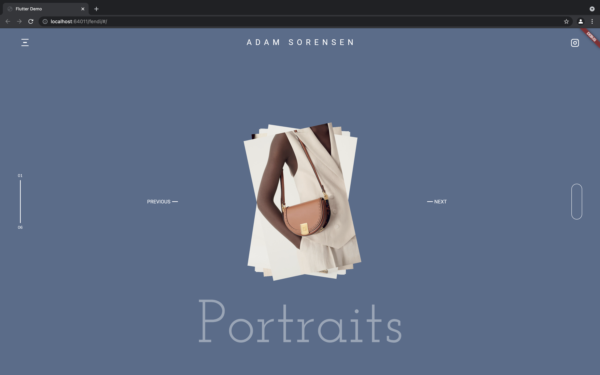

# Fendi LookBook
<h1 align="center">https://davies-k.github.io/fendi</h2>

This is the widely known Fendi Collection or Lookbook, built with flutter.

It is inspired by <a href="https://www.fendi.com/us/woman/highlights/spring-summer-2021-catalogue"> Fendi Summer 2021 Catalogue</a>

  

https://twitter.com/i/status/1413525493182353408

Portfolio inspired by <a href="https://dribbble.com/shots/10722222-Adam-Sorensen-Portfolio">Adam Sorensen on Dribble.</a> Animations for this portfolio is not yet completed.

  

  

  

